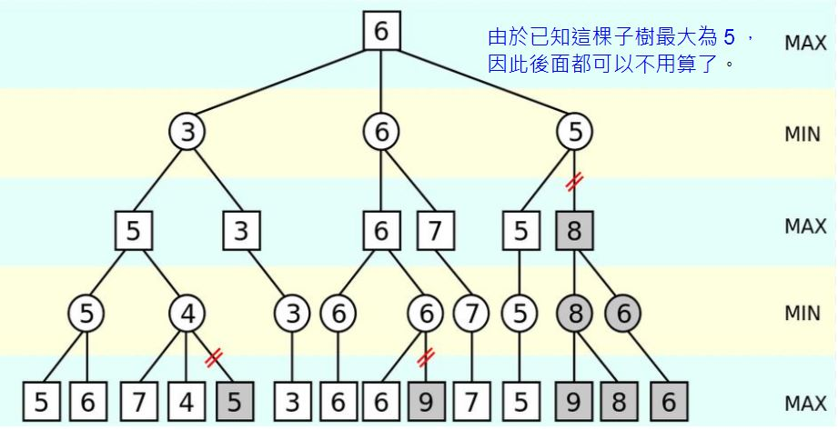

## 期末專案 五子棋
本專案程式碼來自柯宏吉的[人工智慧期末專案 五子棋](https://github.com/www-abcdefg/ai109b/tree/main/%E6%9C%9F%E6%9C%AB)  
學習運作流程後加上註解   
[程式碼](myfinal.py)上的所有註解均由本人編寫  
## 其餘參考資料
[gobang_AI](https://github.com/colingogogo/gobang_AI#gobang_ai)  
[Min-Max 對局搜尋法](https://gitlab.com/ccc109/ai/-/blob/master/11-chess/02-Min-Max%E5%B0%8D%E5%B1%80%E6%90%9C%E5%B0%8B%E6%B3%95.md)  
[gomoku.py](https://gitlab.com/ccc109/ai/-/blob/master/11-chess/01-gomoku/gomoku.py)  

## Min-Max對局搜尋法
  

## alpha-beta剪枝搜尋
  

## 程式碼
```py
import random 
import sys
import time
from torch import rand


# 棋盤
class Board:
    def __init__(self, rMax, cMax):
        self.m = [None] * rMax
        self.rMax = rMax
        self.cMax = cMax
        for r in range(rMax):
            self.m[r] = [None] * cMax
            for c in range(cMax):
                self.m[r][c] = '-'

    #  將棋盤格式化成字串
    def __str__(self):
        b = []
        b.append('  0 1 2 3 4 5 6 7 8 9 a b c d e f')
        for r in range(self.rMax):
            b.append('{:x} {:s} {:x}'.format(r, ' '.join(self.m[r]), r))
            # r.toString(16) + ' ' + self.m[r].join(' ') + ' ' + r.toString(16) + '\n'

        b.append('  0 1 2 3 4 5 6 7 8 9 a b c d e f')
        return '\n'.join(b)

    #  顯示棋盤
    def show(self):
        print(str(self))

# 得分模型
shape_score = [(50, (0, 1, 1, 0, 0)),
               (50, (0, 0, 1, 1, 0)),
               (200, (1, 1, 0, 1, 0)),
               (500, (0, 0, 1, 1, 1)),
               (500, (1, 1, 1, 0, 0)),
               (5000, (0, 1, 1, 1, 0)),
               (5000, (0, 1, 0, 1, 1, 0)),
               (5000, (0, 1, 1, 0, 1, 0)),
               (5000, (1, 1, 1, 0, 1)),
               (5000, (1, 1, 0, 1, 1)),
               (5000, (1, 0, 1, 1, 1)),
               (5000, (1, 1, 1, 1, 0)),
               (5000, (0, 1, 1, 1, 1)),
               (50000, (0, 1, 1, 1, 1, 0)),
               (99999999, (1, 1, 1, 1, 1))]

listAI = []
listHuman = []
listAllStep = []

listBoard = []

next_point = [0,0]

ratio = 1
DEPTH = 3
        
for i in range(16):
    for j in range(16):
        listBoard.append((i,j))

# 電腦棋路計算
def ai():
    global cut_count 
    cut_count = 0
    global search_count
    search_count = 0
    # 先手AI第一步
    firstPoint = (8,8)
    if not listAllStep: 
        listAllStep.append(firstPoint)
        listAI.append(firstPoint)

        return firstPoint[0],firstPoint[1]
    else:
        negamax(True, DEPTH, -99999999, 99999999)
        return next_point[0], next_point[1]
# 
def negamax(is_ai, depth, alpha, beta):
    # 如果深度見底，開始評分
    if depth==0:
        return evaluation(is_ai)
    # 去掉已經下過的位置
    blank_list = list(set(listBoard).difference(set(listAllStep)))
    # 排序
    order(blank_list)
    # 對每個空位做檢查
    for next_step in blank_list:
        global search_count
        search_count += 1
        # 如果這位周圍沒有棋子，就跳過
        if not has_heightnor(next_step):
            continue
        # 加入棋步
        if is_ai:
            listAI.append(next_step)
        else:
            listHuman.append(next_step)
        listAllStep.append(next_step)
        value = -negamax(not is_ai, depth-1, -beta, -alpha)
        if is_ai:
            listAI.remove(next_step)
        else:
            listHuman.remove(next_step)
        listAllStep.remove(next_step)
        if value > alpha:
            if depth == DEPTH:
                next_point[0] = next_step[0]
                next_point[1] = next_step[1]
            if value >= beta:
                global cut_count
                cut_count += 1
                return beta
            alpha = value
    return alpha

def order(blank_list):
    last_pt = listAllStep[-1]
    for item in blank_list:
        for i in range(-1, 2):
            for j in range(-1, 2):
                if i==0 and j==0:
                    continue
                if(last_pt[0]+i, last_pt[1]+j) in blank_list:
                    blank_list.remove((last_pt[0]+i, last_pt[1]+j))
                    blank_list.insert(0,(last_pt[0]+i,last_pt[1]+j))


def has_heightnor(pt):
    for i in range(-1,2):
        for j in range(-1,2):
            if i==0 and j==0:
                continue
            if (pt[0]+i, pt[1]+j) in listAllStep:
                return True

# 評估函數
def evaluation(is_ai):
    total_score = 0
    if is_ai:
        my_list=listAI
        enemy_list = listHuman
    else:
        my_list=listHuman
        enemy_list = listAI
    score_all_arr = []
    my_score = 0
    # 我方在這個位置有多大價值
    for pt in my_list:
        m = pt[0]
        n = pt[1]
        # 上下
        my_score += cal_score(m,n,0,1,enemy_list,my_list,score_all_arr)
        # 左右
        my_score += cal_score(m,n,1,0,enemy_list,my_list,score_all_arr)
        # 右斜
        my_score += cal_score(m,n,1,1,enemy_list,my_list,score_all_arr)
        # 左斜
        my_score += cal_score(m,n,-1,1,enemy_list,my_list,score_all_arr)
    # 對方在這個位置有多大價值
    score_all_arr_enemy = []
    enemy_score = 0
    for pt in enemy_list:
        m = pt[0]
        n = pt[1]
        enemy_score += cal_score(m,n,0,1,my_list,enemy_list,score_all_arr_enemy)
        enemy_score += cal_score(m,n,1,0,my_list,enemy_list,score_all_arr_enemy)
        enemy_score += cal_score(m,n,1,1,my_list,enemy_list,score_all_arr_enemy)
        enemy_score += cal_score(m,n,-1,1,my_list,enemy_list,score_all_arr_enemy)
    # 綜合分數
    total_score = my_score-enemy_score*ratio*0.1
    return total_score
#             位置         連線角度        敵人棋位    我方棋位     記分欄             
def cal_score(m, n, x_decrict, y_derice, enemy_list, my_list, score_all_arr):
    add_score = 0
    max_score_shape = (0,None)
    
    for item in score_all_arr:
        for pt in item[1]:
            if m == pt[0] and n == pt[1] and x_decrict == item[2][0] and y_derice == item[2][1]:
                return 0
    # 從-5到0
    for offset in range(-5,1):
        pos=[]
        # 從0到6
        for i in range(0,6):
            # 如果有敵方可能連線
            if(m+(i+offset)*x_decrict, n+(i+offset)*y_derice) in  enemy_list:
                pos.append(2)
            # 如果有我方可能連線
            elif (m + (i + offset) * x_decrict, n + (i + offset) * y_derice) in my_list:
                pos.append(1)
            # 都沒有
            else:
                pos.append(0)
        tmp_shap5 = (pos[0], pos[1], pos[2], pos[3], pos[4])
        tmp_shap6 = (pos[0], pos[1], pos[2], pos[3], pos[4], pos[5])
        # 從得分模型中開始比對
        for (score, shape) in shape_score:
            # 如果我方符合其中一個模型
            if tmp_shap5 == shape or tmp_shap6 == shape:
                # 如果大於目前最大得分
                if score > max_score_shape[0]:
                    max_score_shape = (score, ((m + (0+offset) * x_decrict, n + (0+offset) * y_derice),
                                               (m + (1+offset) * x_decrict, n + (1+offset) * y_derice),
                                               (m + (2+offset) * x_decrict, n + (2+offset) * y_derice),
                                               (m + (3+offset) * x_decrict, n + (3+offset) * y_derice),
                                               (m + (4+offset) * x_decrict, n + (4+offset) * y_derice)), (x_decrict, y_derice))
    # 如果一次有兩個活3。給額外分
    if max_score_shape[1] is not None:
        for item in score_all_arr:
            for pt1 in item[1]:
                for pt2 in max_score_shape[1]:
                    if pt1==pt2 and max_score_shape[0] > 10 and item[0] > 10:
                        add_score += item[0] + max_score_shape[0] + 1000   
        score_all_arr.append(max_score_shape) 
    return add_score + max_score_shape[0]

def humanTurn(board, turn):
    global listAllStep
    try:
        xy = input(f"將{turn}下在?")
        r = int(xy[0], 16)
        c = int(xy[1], 16)
        # 要下在邊界裡
        if r < 0 or r > board.rMax or c < 0 or c > board.cMax:
            raise Exception (f"{r}, {c} is out of border")
        # Not empty
        if board.m[r][c] != "-":
            raise Exception (f"{r}, {c} is occupied.")
        board.m[r][c] = turn
        listHuman.append((r, c))
        listAllStep.append((r, c))
    except Exception as e:
        print("!!!!!!!!!!!!!! Attention !!!!!!!!!!!!!!\n")
        print(f"Got Error {e}")
        print("\n!!!!!!!!!!!!!! Attention !!!!!!!!!!!!!!")
        humanTurn(board, turn)
# ai下棋
def computerTurn(board, turn):
    print("Computer's Turn")
    # 計算
    aiStep = ai()
    board.m[aiStep[0]][aiStep[1]]=turn
    listAllStep.append(aiStep)
    listAI.append(aiStep)

z9 = [0, 0, 0, 0, 0, 0, 0, 0, 0]
i9 = [-4, -3, -2, -1, 0, 1, 2, 3, 4]
d9 = [4, 3, 2, 1, 0, -1, -2, -3, -4]
z5 = [0, 0, 0, 0, 0]
i2 = i9[2:-2]
d2 = d9[2:-2]

def patternCheck(board, turn, r, c, dr, dc):
    for i in range(len(dr)):
        tr = round(r+dr[i])
        tc = round(c + dc[i])
        if tr<0 or tr>=board.rMax or tc<0 or tc>=board.cMax:
            return False
        v = board.m[tr][tc]
        if(v != turn):
            return False
    return True

def chess(o,x):
    # 棋盤
    b = Board(16,16)
    b.show()
    while True:
        print(o)
        if o=='p':
            humanTurn(b,'o')
        else:
            computerTurn(b, 'o')
        b.show()
        winCheck(b,'o')
        if x=='p':
            humanTurn(b, 'x')
        else:
            computerTurn(b, 'x')
        b.show()
        winCheck(b, 'x')
        # time.sleep(0.5)

def winCheck(board, turn):
    win = False
    tie = True
    # 搜尋棋局
    for r in range(board.rMax):
        for c in range(board.cMax):
            tie = False if board.m[r][c] == '-' else tie
            win = True if patternCheck(board, turn, r, c, z5, i2) else win #  水平 -
            win = True if patternCheck(board, turn, r, c, i2, z5) else win #  垂直 |
            win = True if patternCheck(board, turn, r, c, i2, i2) else win #  下斜 \
            win = True if patternCheck(board, turn, r, c, i2, d2) else win #  上斜 /
    if(win):
        print('{} 贏了！'.format(turn)) 
        sys.exit() 
    if(tie):
        print('平手')
        sys.exit(0)

    return win
user1 = input("User1 : c/p ").lower()
user2 = input("User2 : c/p ").lower()
o, x = user1, user2
user1 = "Computer" if user1=="c" else "Human"
user2 = "Computer" if user2=="c" else "Human"
print(f"User1 : {user1}, User2 : {user2}")
# 進入遊戲
chess(o, x)
```
## 授權聲明
[授權聲明](../README.md)  

