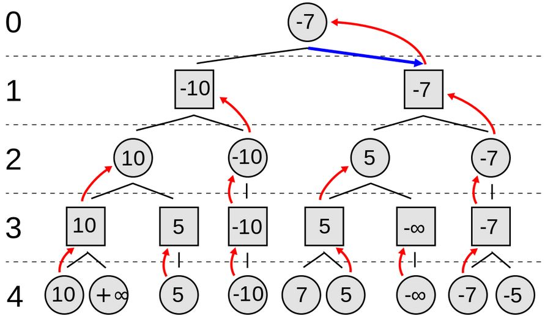

# 人工智慧 第 7 週 -- 電腦下棋

## Minimax演算法
[Minimax演算法](https://zh.wikipedia.org/zh-tw/%E6%9E%81%E5%B0%8F%E5%8C%96%E6%9E%81%E5%A4%A7%E7%AE%97%E6%B3%95)
是一種找出失敗的最大可能性中的最小值的演算法。  
Minimax演算法常用於棋類等由兩方較量的遊戲和程式。該演算法是一個零總和演算法，即一方要在可選的選項中選擇將其優勢最大化的選擇，另一方則選擇令對手優勢最小化的方法。而開始的時候總和為0。  



## 五子棋遊戲
  
```
五子棋遊戲，單機命令列版 -- 作者：陳鍾誠

人對人下  ：python gomoku.py P P
人對電腦  ：python gomoku.py P C
電腦對電腦：python gomoku.py C C
```
