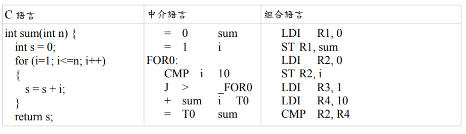

## 人工智慧 第 8 週 -- 語言處理
[語言處理技術](https://speakerdeck.com/ccckmit/yu-yan-chu-li-ji-shu)  
[語言處理](https://gitlab.com/ccc109/ai/-/blob/master/10-lang/rule/01-basic/01-%E8%AA%9E%E8%A8%80%E8%99%95%E7%90%86%E7%B0%A1%E4%BB%8B.md)  
## 自然語言
由歷史過程衍生出來的語言稱為「自然語言」，常見有: 中文、英文、日文等各國語言。  
非刻意設計出來的語言，而由某人創造設計出來的語言稱為人造語言，而前述兩者之結合稱為標記語言。
在資訊工程的領域是需要面對及研究的課題。  
## 人造語言
人造語言的種類很多，但大部分都是程式類的語言，像是高階語言 (像是 C、Ruby、Python)、組合語言 (像是 x86、ARM、CPU0 的組合語言)、還有高階語言在翻譯成組合語言之前通常會經過某種中介語言等等，以下是一些人造語言的範例。   
  
## 語言的層次
語言處理可分為詞彙、語句、文章三個層次  
  
## Chomsky Hierarchy (喬姆斯基語言階層）

Type1 語言的語法有點限制，因為每個規則的左邊至少要有一個非終端項目 A，但其前後可以連接任意規則，這種語法所能描述的語言稱為「對上下文敏感的語言」 (Context-Sensitive)，因為 可以決定之後到底是否要接 ，所以前後文之間是有關係的，因此才叫做「對上下文敏感的語言」。這種語言在計算理論上可以對應到「線性有界的非決定性圖靈機」，也就是一台「記憶體有限的電腦」。  
Type2 語言的語法限制更大，因為規則左邊只能有一個非終端項目 (以 A 代表)，規則右邊則沒有限制這種語言被稱為「上下文無關的語言」(Context Free) ，在計算理論上可以對應到 「非決定性的堆疊機」(non-deterministic pushdown automaton)。  
Type3 的語法限制是最多的，其規則的左右兩邊都最多只能有一個非終端項目 (以 A, B 表示) ，而且右端的終端項目 (以 a 表示) 只能放在非終端項目 B 的前面。這種語言稱為「正規式」(Regular)，可以用程式設計中常用的「正規表達式」(Regular Expression) 表示，對應到計算理論中的有限狀態機(Finite State Automaton)。  

Type2 所不能處理的語言當中，有個最著名的範例是 anbncna_nb_nc_nan​bn​cn​ ，由於這當中 abc 三個字母必須按照順序各出現 n 次，而 Type2 的與上下文無關語法，無法記憶到底已經產生了幾個 ，所以也就無法產生出這樣的語言了。  

## 英翻中
[程式碼](../04/02-lookup/e2c.py)  
使用字典對照處理後輸出中文   
```
PS C:\Users\maybu\Desktop\cccrouse\ai110b\note\04\10-lang\rule\02-lookup> python .\e2c.py a dog chase the cat
['一隻', '狗', '追', '這隻', '貓']
```
## 生成語句
建立語法架構，用遞迴生成完整句子
[程式碼](../04/03-gen/gen_chinese1.py)  
```
PS C:\Users\maybu\Desktop\cccrouse\ai110b\note\04\10-lang\rule\03-gen> python .\gen_chinese1.py
一隻 貓 追 這隻 貓
PS C:\Users\maybu\Desktop\cccrouse\ai110b\note\04\10-lang\rule\03-gen> python .\gen_chinese1.py
一隻 狗 追 一隻 貓
PS C:\Users\maybu\Desktop\cccrouse\ai110b\note\04\10-lang\rule\03-gen> python .\gen_chinese1.py
這隻 狗 吃 一隻 狗
```
[程式碼]()../04/03-gen/gen_chinese2.py)  
```
PS C:\Users\maybu\Desktop\cccrouse\ai110b\note\04\10-lang\rule\03-gen> python .\gen_chinese2.py    
一隻  狗 追 這隻 兇 帥 狗
PS C:\Users\maybu\Desktop\cccrouse\ai110b\note\04\10-lang\rule\03-gen> python .\gen_chinese2.py    
一隻  貓 吃 這隻 兇 狗
PS C:\Users\maybu\Desktop\cccrouse\ai110b\note\04\10-lang\rule\03-gen> python .\gen_chinese2.py    
這隻  狗 吃 一隻  貓
```
[程式碼](../04/03-gen/gen_english1.py)  
```
PS C:\Users\maybu\Desktop\cccrouse\ai110b\note\04\10-lang\rule\03-gen> python .\gen_english1.py    
the cat eat a dog
PS C:\Users\maybu\Desktop\cccrouse\ai110b\note\04\10-lang\rule\03-gen> python .\gen_english1.py    
a dog eat a cat
PS C:\Users\maybu\Desktop\cccrouse\ai110b\note\04\10-lang\rule\03-gen> python .\gen_english1.py    
a dog eat the dog
```
[程式碼](../04/03-gen/gen_exp1.py)
```
PS C:\Users\maybu\Desktop\cccrouse\ai110b\note\04\10-lang\rule\03-gen> python .\gen_exp1.py        
2 = 2
PS C:\Users\maybu\Desktop\cccrouse\ai110b\note\04\10-lang\rule\03-gen> python .\gen_exp1.py        
2-2+7 = 7
PS C:\Users\maybu\Desktop\cccrouse\ai110b\note\04\10-lang\rule\03-gen> python .\gen_exp1.py        
4*1 = 4
PS C:\Users\maybu\Desktop\cccrouse\ai110b\note\04\10-lang\rule\03-gen> python .\gen_exp1.py        
4/6+3 = 3.6666666666666665
```
