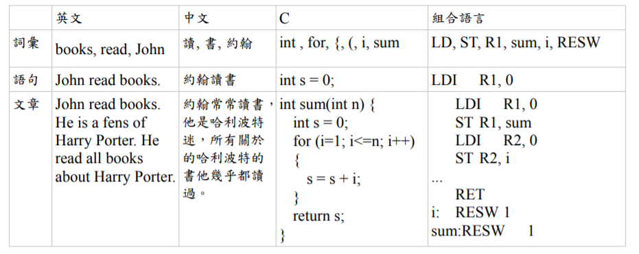

## 人工智慧 第 10 週 -- 語言處理＋機器學習 1

## 語意辨識
[語言處理技術](https://speakerdeck.com/ccckmit/yu-yan-chu-li-ji-shu)  
## 生成語法
## Chomsky Hierarchy (喬姆斯基語言階層）
  
Type1 語言的語法有點限制，因為每個規則的左邊至少要有一個非終端項目 A，但其前後可以連接任意規則，這種語法所能描述的語言稱為「對上下文敏感的語言」 (Context-Sensitive)，因為 可以決定之後到底是否要接 ，所以前後文之間是有關係的，因此才叫做「對上下文敏感的語言」。這種語言在計算理論上可以對應到「線性有界的非決定性圖靈機」，也就是一台「記憶體有限的電腦」。  
Type2 語言的語法限制更大，因為規則左邊只能有一個非終端項目 (以 A 代表)，規則右邊則沒有限制這種語言被稱為「上下文無關的語言」(Context Free) ，在計算理論上可以對應到 「非決定性的堆疊機」(non-deterministic pushdown automaton)。  
Type3 的語法限制是最多的，其規則的左右兩邊都最多只能有一個非終端項目 (以 A, B 表示) ，而且右端的終端項目 (以 a 表示) 只能放在非終端項目 B 的前面。這種語言稱為「正規式」(Regular)，可以用程式設計中常用的「正規表達式」(Regular Expression) 表示，對應到計算理論中的有限狀態機(Finite State Automaton)。  
  
Type2 所不能處理的語言當中，有個最著名的範例是 anbncna_nb_nc_nan​bn​cn​ ，由於這當中 abc 三個字母必須按照順序各出現 n 次，而 Type2 的與上下文無關語法，無法記憶到底已經產生了幾個 ，所以也就無法產生出這樣的語言了。  
  
## 語言的層次
語言處理可分為詞彙、語句、文章三個層次  
  

## 神經網路
[Conditional Generation by RNN & Attention 李宏毅](http://speech.ee.ntu.edu.tw/~tlkagk/courses/MLDS_2017/Lecture/Attain%20(v5).pdf)
