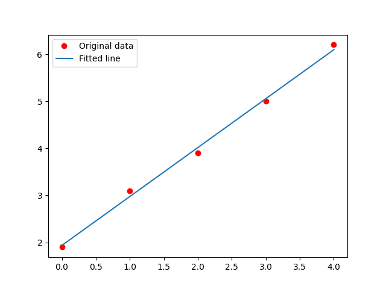

## 人工智慧 第 1１ 週 -- 神經網路 -- 梯度下降法

## 梯度下降法
[梯度下降法](https://kinmen6.com/root/%E9%99%B3%E9%8D%BE%E8%AA%A0/%E8%AA%B2%E7%A8%8B/%E4%BA%BA%E5%B7%A5%E6%99%BA%E6%85%A7/07-neural/02-gradient/%E6%A2%AF%E5%BA%A6%E4%B8%8B%E9%99%8D%E6%B3%95.md)  

深度學習 (Deep Learning) 是人工智慧領域當紅的技術，說穿了其實就是原本的《神經網路》(Neural Network) ，不過由於加上了一些新的模型 (像是捲積神經網路 CNN, 循環神經網路 RNN 與生成對抗網路 GAN)，還有在神經網路的層數上加深很多，從以往的 3-4 層，提升到了十幾層，甚至上百層，於是我們給這些新一代的《神經網路》技術一個統稱，那就是《深度學習》。  
## 單變數微分
[程式碼](../04/02-gradient/01-diff/diff.py)
```
PS C:\Users\maybu\Desktop\cccrouse\ai110b\note\04\02-gradient\01-diff> python .\diff.py
diff(f,2)= 12.006000999997823
```
## 多變數微分
[程式碼](../04/02-gradient/01-diff/diff2.py)  
```
PS C:\Users\maybu\Desktop\cccrouse\ai110b\note\04\02-gradient\01-diff> python .\diff2.py
diff(square,2)= 4.000999999999699
diff(power3,1)= 3.0030009999995055
diff(power3,2)= 12.0060009999996
diff(triple,1)= 2.9999999999996696
diff(triple,2)= 3.0000000000001137
```
## 梯度
[梯度](https://zh.wikipedia.org/zh-tw/%E6%A2%AF%E5%BA%A6)  
[程式碼](../04/02-gradient/02-gradient/npGradient.py) 
```
PS C:\Users\maybu\Desktop\cccrouse\ai110b\note\04\02-gradient\02-gradient> python .\npGradient.py
df(f, p, 0) =  2.009999999999934
df(f, p, 1) =  6.009999999999849
grad(f)= [2.01 6.01]
```

[程式碼](../04/02-gradient/02-gradient/vecGradient.py)  
```
PS C:\Users\maybu\Desktop\cccrouse\ai110b\note\04\02-gradient\02-gradient> python .\vecGradient.py       
x= 1 y= 3
df(f(x,y), 0) =  2.009999999999934
df(f(x,y), 1) =  6.009999999999849
grad(f)= [2.009999999999934, 6.009999999999849]
```

## 散度
[散度](https://zh.wikipedia.org/wiki/%E6%95%A3%E5%BA%A6)  
f = (3xz, 2xy, -yz^2)  
div f = 3z+2x-2yz  
在 (x,y,z)=(1,0,3) 時，答案應為 (3*3+2*1+0)=11, 非常接近！  
[程式碼](vfield/div1.py)  
```
PS C:\Users\maybu\Desktop\cccrouse\ai110b\note\04\vfield> python .\div1.py
div(f,p)= 10.999999999998565
```
## gd1.py
```
import numpy as np
from numpy.linalg import norm

# 函數 f 對變數 k 的偏微分: df / dk
def df(f, p, k, step=0.01):
    p1 = p.copy()
    p1[k] = p[k]+step
    return (f(p1) - f(p)) / step

# 函數 f 在點 p 上的梯度
def grad(f, p, step=0.01):
    gp = p.copy()
    for k in range(len(p)):
        gp[k] = df(f, p, k, step)
    return gp

# 使用梯度下降法尋找函數最低點
def gradientDescendent(f, p0, step=0.01):
    p = p0.copy()
    i = 0
    while (True):
        i += 1
        fp = f(p)
        gp = grad(f, p) # 計算梯度 gp
        glen = norm(gp) # norm = 梯度的長度 (步伐大小)
        print('{:d}:p={:s} f(p)={:.3f} gp={:s} glen={:.5f}'.format(i, str(p), fp, str(gp), glen))
        if glen < 0.00001:  # 如果步伐已經很小了，那麼就停止吧！
            break
        gstep = np.multiply(gp, -1*step) # gstep = 逆梯度方向的一小步
        p +=  gstep # 向 gstep 方向走一小步
    return p # 傳回最低點！
```
## gdTest
[程式碼](02-gradient/03-gd/gradTest.py)  
```
PS C:\Users\maybu\Desktop\cccrouse\ai110b\note\04\02-gradient\03-gd> python .\gdTest.py
1:p=[1.0, 3.0] f(p)=10.000 gp=[2.009999999999934, 6.009999999999849] glen=6.33721
2:p=[0.9799 2.9399] f(p)=9.603 gp=[1.9698 5.8898] glen=6.21046
3:p=[0.960202 2.881002] f(p)=9.222 gp=[1.930404 5.772004] glen=6.08625
4:p=[0.94089796 2.82328196] f(p)=8.856 gp=[1.89179592 5.65656392] glen=5.96453 
5:p=[0.92198    2.76671632] f(p)=8.505 gp=[1.85396    5.54343264] glen=5.84524 
...    
660:p=[-0.00499834 -0.00499504] f(p)=0.000 gp=[3.32031998e-06 9.92792193e-06] glen=0.00001        
661:p=[-0.00499837 -0.00499514] f(p)=0.000 gp=[3.25391358e-06 9.72936349e-06] glen=0.00001        
662:p=[-0.00499841 -0.00499523] f(p)=0.000 gp=[3.18883531e-06 9.53477622e-06] glen=0.00001        
663:p=[-0.00499844 -0.00499533] f(p)=0.000 gp=[3.1250586e-06 9.3440807e-06] glen=0.00001
```
## gdArray
[程式碼](02-gradient/03-gd/gdArray.py) 
```
PS C:\Users\maybu\Desktop\cccrouse\ai110b\note\04\02-gradient\03-gd> python .\gdArray.py
1:p=[0.0, 0.0, 0.0] f(p)=20.312 gp=[-2.705999999999875, -4.233999999999938, -7.463999999999871] glen=8.99780
2:p=[0.02706 0.04234 0.07464] f(p)=19.509 gp=[-2.65188 -4.14932 -7.31472] glen=8.81785
3:p=[0.0535788 0.0838332 0.1477872] f(p)=18.738 gp=[-2.5988424 -4.0663336 -7.1684256] glen=8.64149       
...
679:p=[1.35299848 2.11699762 3.7319958 ] f(p)=0.000 gp=[-3.04513893e-06 -4.76464088e-06 -8.39945195e-06] glen=0.00001
680:p=[1.35299851 2.11699767 3.73199588] f(p)=0.000 gp=[-2.98423615e-06 -4.66934807e-06 -8.23146292e-06] glen=0.00001
PS C:\Users\maybu\Desktop\cccrouse\ai110b\note\04\02-gradient\03-gd> 
```

## gdGate
[程式碼](02-gradient/03-gd/gdGate.py)  
```
PS C:\Users\maybu\Desktop\cccrouse\ai110b\note\04\02-gradient\03-gd> python .\gdGate.py
2999:p=[ 1.70833465  1.70833465 -2.7326384 ] f(p)=0.506 gp=[-0.04493286 -0.04493286  0.06420767] glen=0.09034
o0=0.061 o1=0.264 o2=0.264 o3=0.665
```

## gdRegression
[程式碼](02-gradient/03-gd/gdRegression.py) 
```
PS C:\Users\maybu\Desktop\cccrouse\ai110b\note\04\02-gradient\05-gdRegression> python .\gdRegression.py
00000:f(p)=91.870 p=[0.0, 0.0] gp=[-40.14999957084626, -101.09999866485708] glen=108.78066
00001:f(p)=12.802 p=[0.4015     1.01099999] gp=[-15.91499988 -32.40999955] glen=36.10672
00002:f(p)=3.970 p=[0.56064999 1.33509998] gp=[-7.84149998 -9.78099984] glen=12.53623
00003:f(p)=2.836 p=[0.63906499 1.43290998] gp=[-5.10115002 -2.34409994] glen=5.61396
00004:f(p)=2.565 p=[0.69007649 1.45635098] gp=[-4.12221503  0.08259003] glen=4.12304
...
00430:f(p)=0.044 p=[1.93499693 1.04000105] gp=[-9.16906467e-06  3.21633422e-06] glen=0.00001      
00430:f(p)=0.044 p=[1.93499693 1.04000105] gp=[-9.16906467e-06  3.21633422e-06] glen=0.00001      
y_predicted= [1.9349969324155516, 2.9749979862968705, 4.014999040178189, 5.055000094059508, 6.0950011479408275]
```
  