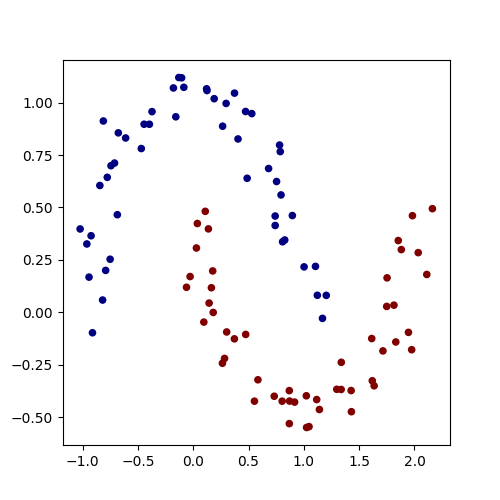
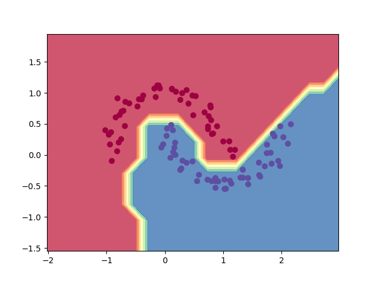

## 人工智慧 第 12 週 -- 反傳遞算法
[Hacker's guide to Neural Networks](http://karpathy.github.io/neuralnets/)
## 反傳遞演算法
[反傳遞演算法](https://kinmen6.com/root/%E9%99%B3%E9%8D%BE%E8%AA%A0/%E8%AA%B2%E7%A8%8B/%E4%BA%BA%E5%B7%A5%E6%99%BA%E6%85%A7/07-neural/03-net/)  
梯度下降法》是《深度學習神經網路》背後的學習算法，但是再輸入變數很多時，純粹靠《多次前向計算》的《梯度下降法》速度會過慢，因此我們需要使用《反傳遞算法》更有效率的計算《梯度》。  
## net1
[程式碼](03-net/01-my/net1.py)
```
PS C:\Users\maybu\Desktop\cccrouse\ai110b\note\05\03-net\01-my> python .\net1.py
net.forward()= 10
net.backwward()
x= v:1 g:2 y= v:3 g:6 o= v:10 g:1
gfx = x.g/o.g =  2.0 gfy = y.g/o.g= 6.0
```
## net2
[程式碼](03-net/01-my/net2.py)  
```
PS C:\Users\maybu\Desktop\cccrouse\ai110b\note\05\03-net\01-my> python .\net2.py
0  =>  10
1  =>  9.216
2  =>  8.4934656
3  =>  7.827577896960003
...
98  =>  0.003350901606872675
99  =>  0.003088190920893857
x= 0.01687031935884968 y= 0.050610958076549
```

### Example usage
```
class Value:
    """ stores a single scalar value and its gradient """

    def __init__(self, data, _children=(), _op=''):
        self.data = data
        self.grad = 0
        # internal variables used for autograd graph construction
        self._backward = lambda: None
        self._prev = set(_children)
        self._op = _op # the op that produced this node, for graphviz / debugging / etc

    def __add__(self, other): # f=x+y
        other = other if isinstance(other, Value) else Value(other)
        out = Value(self.data + other.data, (self, other), '+')

        def _backward():
            self.grad += out.grad  # gx = gf
            other.grad += out.grad # gy = gf
        out._backward = _backward

        return out

    def __mul__(self, other): # f=x*y
        other = other if isinstance(other, Value) else Value(other)
        out = Value(self.data * other.data, (self, other), '*')

        def _backward():
            self.grad += other.data * out.grad # gx = y*gf  gx/gf = y
            other.grad += self.data * out.grad # gy = x*gf
        out._backward = _backward

        return out

    def __pow__(self, other): # f = x**n
        assert isinstance(other, (int, float)), "only supporting int/float powers for now"
        out = Value(self.data**other, (self,), f'**{other}')

        def _backward():
            self.grad += (other * self.data**(other-1)) * out.grad # gx = n (x**n-1)
        out._backward = _backward

        return out

    def relu(self):
        out = Value(0 if self.data < 0 else self.data, (self,), 'ReLU')

        def _backward():
            self.grad += (out.data > 0) * out.grad # gx = 1 if f>0 else 0
        out._backward = _backward

        return out

    def backward(self):

        # topological order all of the children in the graph
        topo = []
        visited = set()
        def build_topo(v):
            if v not in visited:
                visited.add(v)
                for child in v._prev:
                    build_topo(child)
                topo.append(v)
        build_topo(self)

        # go one variable at a time and apply the chain rule to get its gradient
        self.grad = 1
        for v in reversed(topo):
            v._backward()

    def __neg__(self): # -self
        return self * -1

    def __radd__(self, other): # other + self
        return self + other

    def __sub__(self, other): # self - other
        return self + (-other)

    def __rsub__(self, other): # other - self
        return other + (-self)

    def __rmul__(self, other): # other * self
        return self * other

    def __truediv__(self, other): # self / other
        return self * other**-1

    def __rtruediv__(self, other): # other / self
        return other * self**-1

    def __repr__(self): # 轉字串 -- https://www.educative.io/edpresso/what-is-the-repr-method-in-python
        return f"Value(data={self.data}, grad={self.grad})"
```
[程式碼](03-net/02-micrograd/ex1.py)  
```
PS C:\Users\maybu\Desktop\cccrouse\ai110b\note\05\03-net\02-micrograd> python .\ex1.py
24.7041
138.8338
645.5773
```

## demo
[程式碼](03-net/02-micrograd/demo.py)  
```
PS C:\Users\maybu\Desktop\cccrouse\ai110b\note\05\03-net\02-micrograd> python .\demo.py
MLP of [Layer of [ReLUNeuron(2), ReLUNeuron(2), ReLUNeuron(2), ReLUNeuron(2), ReLUNeuron(2), ReLUNeuron(2), ReLUNeuron(2), ReLUNeuron(2), ReLUNeuron(2), ReLUNeuron(2), ReLUNeuron(2), ReLUNeuron(2), ReLUNeuron(2), ReLUNeuron(2), ReLUNeuron(2), ReLUNeuron(2)], Layer of [ReLUNeuron(16), ReLUNeuron(16), ReLUNeuron(16), ReLUNeuron(16), ReLUNeuron(16), ReLUNeuron(16), ReLUNeuron(16), ReLUNeuron(16), ReLUNeuron(16), ReLUNeuron(16), ReLUNeuron(16), ReLUNeuron(16), ReLUNeuron(16), ReLUNeuron(16), ReLUNeuron(16), ReLUNeuron(16)], Layer of [LinearNeuron(16)]]
number of parameters 337
Value(data=0.8862514464368222, grad=0) 0.5
step 0 loss 0.8862514464368222, accuracy 50.0%
step 1 loss 1.7136790633950052, accuracy 81.0%
step 2 loss 0.7333961267286989, accuracy 77.0%
step 3 loss 0.7615247055858606, accuracy 82.0%
...
step 94 loss 0.0, accuracy 100.0%
step 95 loss 0.0, accuracy 100.0%
step 96 loss 0.0, accuracy 100.0%
step 97 loss 0.0, accuracy 100.0%
step 98 loss 0.0, accuracy 100.0%
step 99 loss 0.0, accuracy 100.0%
```

