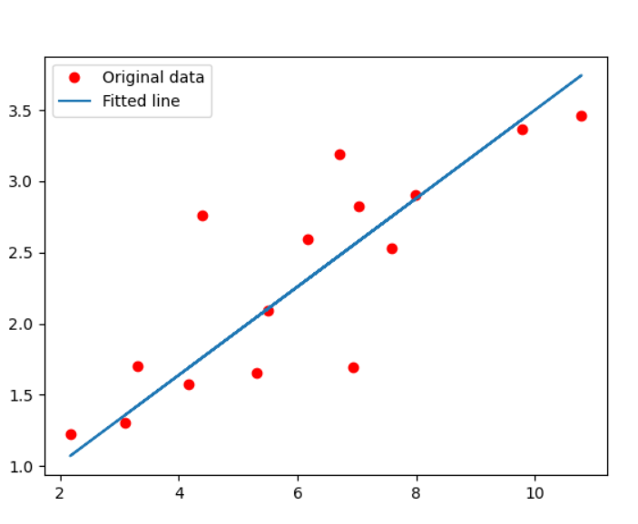

# Linear Regression

* https://github.com/yunjey/pytorch-tutorial/blob/master/tutorials/01-basics/linear_regression/main.py#L22-L23


```
PS D:\pmedia\陳鍾誠\課程\人工智慧\08-deep\04-regression\linear_regression> python main.py
Epoch [5/60], Loss: 1.4778
Epoch [10/60], Loss: 0.9436
Epoch [15/60], Loss: 0.7265
Epoch [20/60], Loss: 0.6380
Epoch [25/60], Loss: 0.6015
Epoch [30/60], Loss: 0.5860
Epoch [35/60], Loss: 0.5792
Epoch [40/60], Loss: 0.5758
Epoch [45/60], Loss: 0.5738
Epoch [50/60], Loss: 0.5724
Epoch [55/60], Loss: 0.5712
Epoch [60/60], Loss: 0.5701
```


