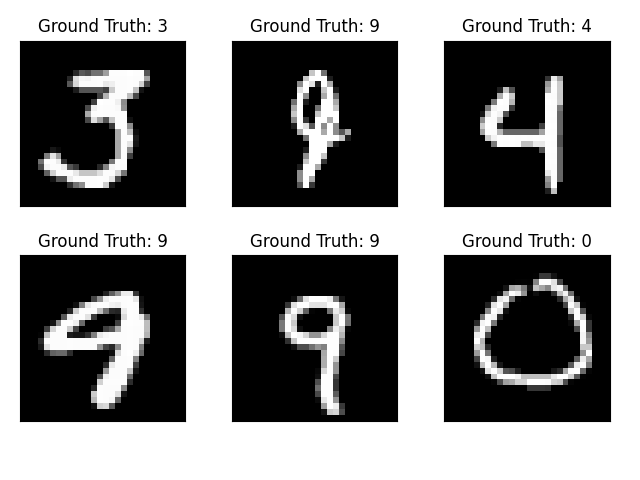
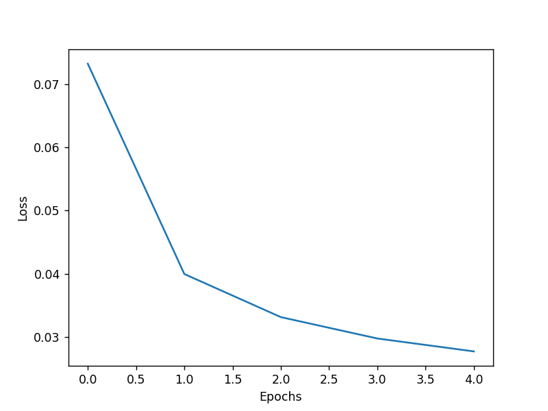

## 人工智慧 第 13 週 -- Pytorch
[Pytorch](https://pytorch.org/)
## autograd0
[程式碼](05-torch/autograd0.py)
```
PS C:\Users\maybu\Desktop\cccrouse\ai110b\note\05\05-torch> python .\autograd0.py
tensor(2.)
tensor(6.)
tensor(10., grad_fn=<AddBackward0>)
10.0
```
## autograd1
[程式碼](05-torch/autograd1.py)
```
PS C:\Users\maybu\Desktop\cccrouse\ai110b\note\05\05-torch> python .\autograd1.py 
tensor([2.])
```
## autograd2
[程式碼](05-torch/autograd2.py)
```
PS C:\Users\maybu\Desktop\cccrouse\ai110b\note\05\05-torch> python .\autograd2.py
z= tensor(2.2361, grad_fn=<CopyBackwards>)
x.grad= tensor([0.4472, 0.8944])
```

## torchGd1
[程式碼](06-torchGd/torchGd1.py)  
```
PS C:\Users\maybu\Desktop\cccrouse\ai110b\note\05\06-torchGd> python .\torchGd1.py
99 x= 0.04734534025192261 loss= 3.8128602504730225
199 x= 0.4016216993331909 loss= 2.5548131465911865
299 x= 0.691620409488678 loss= 1.7118570804595947
399 x= 0.929003894329071 loss= 1.1470327377319336
499 x= 1.123318076133728 loss= 0.768571138381958
599 x= 1.2823774814605713 loss= 0.5149822235107422
699 x= 1.4125778675079346 loss= 0.345064640045166
799 x= 1.5191551446914673 loss= 0.23121166229248047
899 x= 1.606396198272705 loss= 0.1549239158630371
999 x= 1.6778098344802856 loss= 0.1038064956665039
1099 x= 1.736265778541565 loss= 0.06955575942993164
1199 x= 1.7841155529022217 loss= 0.04660606384277344
1299 x= 1.8232847452163696 loss= 0.031228303909301758
1399 x= 1.8553467988967896 loss= 0.02092456817626953
1499 x= 1.8815923929214478 loss= 0.014020442962646484
1599 x= 1.9030756950378418 loss= 0.009394407272338867
1699 x= 1.9206604957580566 loss= 0.006294727325439453
1799 x= 1.9350556135177612 loss= 0.004217863082885742
1899 x= 1.9468388557434082 loss= 0.002826213836669922
1999 x= 1.9564839601516724 loss= 0.001893758773803711
2099 x= 1.9643794298171997 loss= 0.0012688636779785156
2199 x= 1.9708417654037476 loss= 0.0008502006530761719
2299 x= 1.9761319160461426 loss= 0.0005695819854736328
2399 x= 1.9804620742797852 loss= 0.00038170814514160156
2499 x= 1.9840068817138672 loss= 0.00025582313537597656
2599 x= 1.9869086742401123 loss= 0.00017142295837402344
2699 x= 1.9892841577529907 loss= 0.00011491775512695312
2799 x= 1.9912283420562744 loss= 7.700920104980469e-05
2899 x= 1.9928197860717773 loss= 5.14984130859375e-05
2999 x= 1.9941226243972778 loss= 3.457069396972656e-05
3099 x= 1.9951890707015991 loss= 2.3126602172851562e-05
3199 x= 1.9960618019104004 loss= 1.5497207641601562e-05
3299 x= 1.9967764616012573 loss= 1.049041748046875e-05
3399 x= 1.997361421585083 loss= 6.9141387939453125e-06
3499 x= 1.9978400468826294 loss= 4.76837158203125e-06
3599 x= 1.9982320070266724 loss= 3.0994415283203125e-06
3699 x= 1.998552680015564 loss= 2.1457672119140625e-06
3799 x= 1.9988151788711548 loss= 1.430511474609375e-06
3899 x= 1.9990301132202148 loss= 9.5367431640625e-07
3999 x= 1.9992061853408813 loss= 7.152557373046875e-07
4099 x= 1.9993499517440796 loss= 4.76837158203125e-07
4199 x= 1.9994677305221558 loss= 2.384185791015625e-07
4299 x= 1.9995644092559814 loss= 2.384185791015625e-07
4399 x= 1.9996428489685059 loss= 2.384185791015625e-07
4499 x= 1.9997074604034424 loss= 0.0
4599 x= 1.9997600317001343 loss= 0.0
4699 x= 1.9998036623001099 loss= 0.0
4799 x= 1.999839425086975 loss= 0.0
4899 x= 1.9998672008514404 loss= 0.0
4999 x= 1.9998910427093506 loss= 0.0
Result: x = 1.9998912811279297 loss=0.0
```
## torchGd1
[程式碼](06-torchGd/torchGd2.py)  
```
PS C:\Users\maybu\Desktop\cccrouse\ai110b\note\05\06-torchGd> python .\torchGd2.py
99 parameters= [tensor(0.8906, requires_grad=True)] loss= 1.230787754058838
199 parameters= [tensor(1.0919, requires_grad=True)] loss= 0.8246903419494629
299 parameters= [tensor(1.2566, requires_grad=True)] loss= 0.5525848865509033
399 parameters= [tensor(1.3915, requires_grad=True)] loss= 0.37026023864746094
499 parameters= [tensor(1.5019, requires_grad=True)] loss= 0.248093843460083
599 parameters= [tensor(1.5923, requires_grad=True)] loss= 0.16623568534851074
699 parameters= [tensor(1.6663, requires_grad=True)] loss= 0.11138629913330078
799 parameters= [tensor(1.7268, requires_grad=True)] loss= 0.07463455200195312
899 parameters= [tensor(1.7764, requires_grad=True)] loss= 0.05000901222229004
999 parameters= [tensor(1.8169, requires_grad=True)] loss= 0.0335087776184082
1099 parameters= [tensor(1.8502, requires_grad=True)] loss= 0.022452592849731445
1199 parameters= [tensor(1.8773, requires_grad=True)] loss= 0.015044450759887695
1299 parameters= [tensor(1.8996, requires_grad=True)] loss= 0.010080575942993164
1399 parameters= [tensor(1.9178, requires_grad=True)] loss= 0.006754398345947266
1499 parameters= [tensor(1.9327, requires_grad=True)] loss= 0.004525899887084961
1599 parameters= [tensor(1.9449, requires_grad=True)] loss= 0.0030324459075927734
1699 parameters= [tensor(1.9549, requires_grad=True)] loss= 0.002032041549682617
1799 parameters= [tensor(1.9631, requires_grad=True)] loss= 0.0013616085052490234
1899 parameters= [tensor(1.9698, requires_grad=True)] loss= 0.0009121894836425781
1999 parameters= [tensor(1.9753, requires_grad=True)] loss= 0.0006113052368164062
2099 parameters= [tensor(1.9798, requires_grad=True)] loss= 0.0004096031188964844
2199 parameters= [tensor(1.9834, requires_grad=True)] loss= 0.00027441978454589844
2299 parameters= [tensor(1.9864, requires_grad=True)] loss= 0.0001838207244873047
2399 parameters= [tensor(1.9889, requires_grad=True)] loss= 0.0001232624053955078
2499 parameters= [tensor(1.9909, requires_grad=True)] loss= 8.249282836914062e-05
2599 parameters= [tensor(1.9926, requires_grad=True)] loss= 5.53131103515625e-05
2699 parameters= [tensor(1.9939, requires_grad=True)] loss= 3.695487976074219e-05
2799 parameters= [tensor(1.9950, requires_grad=True)] loss= 2.47955322265625e-05
2899 parameters= [tensor(1.9959, requires_grad=True)] loss= 1.6689300537109375e-05
2999 parameters= [tensor(1.9967, requires_grad=True)] loss= 1.1205673217773438e-05
3099 parameters= [tensor(1.9973, requires_grad=True)] loss= 7.3909759521484375e-06
3199 parameters= [tensor(1.9978, requires_grad=True)] loss= 5.0067901611328125e-06
3299 parameters= [tensor(1.9982, requires_grad=True)] loss= 3.337860107421875e-06
3399 parameters= [tensor(1.9985, requires_grad=True)] loss= 2.1457672119140625e-06
3499 parameters= [tensor(1.9988, requires_grad=True)] loss= 1.430511474609375e-06
3599 parameters= [tensor(1.9990, requires_grad=True)] loss= 9.5367431640625e-07
3699 parameters= [tensor(1.9992, requires_grad=True)] loss= 7.152557373046875e-07
3799 parameters= [tensor(1.9993, requires_grad=True)] loss= 4.76837158203125e-07
3899 parameters= [tensor(1.9994, requires_grad=True)] loss= 2.384185791015625e-07
3999 parameters= [tensor(1.9995, requires_grad=True)] loss= 2.384185791015625e-07
4099 parameters= [tensor(1.9996, requires_grad=True)] loss= 2.384185791015625e-07
4199 parameters= [tensor(1.9997, requires_grad=True)] loss= 0.0
4299 parameters= [tensor(1.9998, requires_grad=True)] loss= 0.0
4399 parameters= [tensor(1.9998, requires_grad=True)] loss= 0.0
4499 parameters= [tensor(1.9998, requires_grad=True)] loss= 0.0
4599 parameters= [tensor(1.9999, requires_grad=True)] loss= 0.0
4699 parameters= [tensor(1.9999, requires_grad=True)] loss= 0.0
4799 parameters= [tensor(1.9999, requires_grad=True)] loss= 0.0
4899 parameters= [tensor(1.9999, requires_grad=True)] loss= 0.0
4999 parameters= [tensor(1.9999, requires_grad=True)] loss= 0.0
Result: parameters = [tensor(1.9999, requires_grad=True)] loss=0.0
```

```
PS C:\Users\maybu\Desktop\cccrouse\ai110b\note\05\06-torchGd> python .\torchGd3.py
x= tensor([-0.0018, -0.0035], requires_grad=True)
```
 
## numpyRegression1
```
PS C:\Users\maybu\Desktop\cccrouse\ai110b\note\05\07-torchRegression\example> python .\numpyRegression1.py
99 3183.2020632299846
199 2105.455373402315
299 1392.6332841062772
399 921.162416712995
499 609.3193438298051
599 403.05441571095105
699 266.62020339996366
799 176.37369791640864
899 116.67740694696707
999 77.18852527717442
1099 51.066094726901866
1199 33.785273591748386
1299 22.35312016499927
1399 14.789921955150412
1499 9.786148481842046
1599 6.475557438231625
1699 4.285123025561237
1799 2.8357740977635215
1899 1.8767381803888623
1999 1.2421129541955631
Result: y = 0.004372119530277306 + 0.9659762725562933 x + 1.9992457366286442 x^2 + 3.004839578947642 x^3
```

## torchRegression1
```
PS C:\Users\maybu\Desktop\cccrouse\ai110b\note\05\07-torchRegression\example> python .\torchRegression1.py
99 1036.8038330078125
199 733.0413208007812
299 518.3063354492188
399 366.4953918457031
499 259.1624755859375
599 183.272216796875
699 129.61045837402344
799 91.6646499633789
899 64.83059692382812
999 45.853782653808594
1099 32.43270492553711
1199 22.940689086914062
1299 16.22713851928711
1399 11.478619575500488
1499 8.11984920501709
1599 5.744047164916992
1699 4.06347131729126
1799 2.8746583461761475
1899 2.033686876296997
1999 1.438772201538086
Result: y = 0.04007340222597122 + 0.9977275729179382 x + 1.9930866956710815 x^2 + 3.0003230571746826 x^3
```

```
PS C:\Users\maybu\Desktop\cccrouse\ai110b\note\05\07-torchRegression\example> python .\torchRegression2backword.py
99 120.23033142089844
199 80.41342163085938
299 53.82101821899414
399 36.04744338989258
499 24.16060447692871
599 16.205705642700195
699 10.878438949584961
799 7.308338642120361
899 4.913963317871094
999 3.3069496154785156
1099 2.22744083404541
1199 1.5017132759094238
1299 1.0134392976760864
1399 0.6845585107803345
1499 0.462889701128006
1599 0.3133220970630646
1699 0.2123049795627594
1799 0.14401452243328094
1899 0.0977943018078804
1999 0.06648349016904831
Result: y = 0.005565687548369169 + 0.9939422011375427 x + 1.9990394115447998 x^2 + 3.000861644744873 x^3
```
## torchRegression4nn
```
PS C:\Users\maybu\Desktop\cccrouse\ai110b\note\05\07-torchRegression\example> python .\torchRegression4nn.py      
99 355.7418518066406
199 237.57147216796875
299 158.7510528564453
399 106.14668273925781
499 71.01880645751953
599 47.548248291015625
699 31.856796264648438
799 21.35940933227539
899 14.331987380981445
999 9.624310493469238
1099 6.468244552612305
1199 4.350849628448486
1299 2.9291961193084717
1399 1.9738519191741943
1499 1.331359624862671
1599 0.8988527655601501
1699 0.6074716448783875
1799 0.41096311807632446
1899 0.2783157527446747
1999 0.18866735696792603
linear_layer.weight=Parameter containing:
tensor([[0.9894, 1.9985, 3.0015]], requires_grad=True)
linear_layer.weight[:]=tensor([[0.9894, 1.9985, 3.0015]], grad_fn=<SliceBackward0>)
linear_layer.weight[:,0]=tensor([0.9894], grad_fn=<SelectBackward0>)
linear_layer.weight[:,1]=tensor([1.9985], grad_fn=<SelectBackward0>)
Result: y = 0.00890088640153408 + 0.9894425868988037 x + 1.9984642267227173 x^2 + 3.0015017986297607 x^3
```

## torch_mnist

```
PS C:\Users\maybu\Desktop\cccrouse\ai110b\note\05\08-torch_mnist> python .\mnist.py
```


## np_mnist
```
PS C:\Users\maybu\Desktop\cccrouse\ai110b\note\05\09-np_mnist> python .\mnist.py
start()
load data....
train()
epoch=0
epoch=1
epoch=2
epoch=3
epoch=4
plot()
Accuracy: 87.57142857142857 %
```
